# Module 2: Amazon GuardDuty Walkthrough 

In this section of the Security Workshop, you will follow a guided demonstration of the features of Amazon GuardDuty.  You can use this demonstration to learn about GuardDuty's capabilities.   

**Agenda** 20 minutes
 
1. GuardDuty Findings & Usage Pages
2. Multi-Account Hierarchy
3. Working with Trusted IP Lists and Threat Lists

## GuardDuty Findings & Usage Pages

In this section we will explore two of the pages associated to the GuardDuty service, namely the **Findings** and **Usage** pages. The GuardDuty **Findings** page gives you an overview of security findings of your AWS account(s). 

!!! info "Some of the data in your account may differ from the screenshots and some maybe blank."

1. Type **GuardDuty** in the services search bar.

2. Select **Security Hub** from the list.

    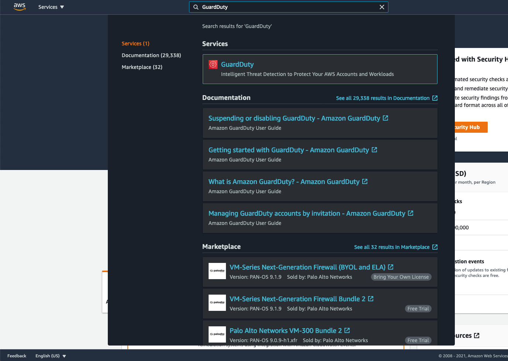

3. Click **Findings** on the left hand navigation.

    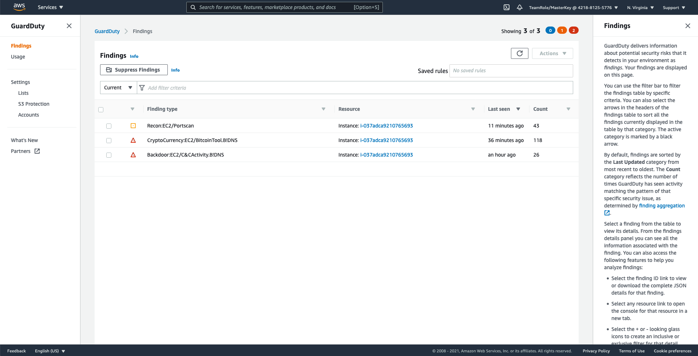

4. Feel free to explore the details of the generated findings.

    !!! info "As Amazon GuardDuty uses multiple data sources to analyze and generate the security findings, it might take a bit of time before you might see any security findings in this view."    

In order to get an understanding of costs associated with GuardDuty, let's view the **Usage** page. Here you can find the details related to costs broken down by data source. You can use the GuardDuty console and API operations to estimate how much GuardDuty will cost you per month. During the 30-day free trial period, the cost estimation projects what your estimated costs will be after the free trial period. If you are operating in a multi-account environment, your GuardDuty administrator account can monitor cost metrics for all of your member accounts.

!!! info "The GuardDuty usage estimate is for the current Region only."

1. Click **Usage** on the left hand navigation.

    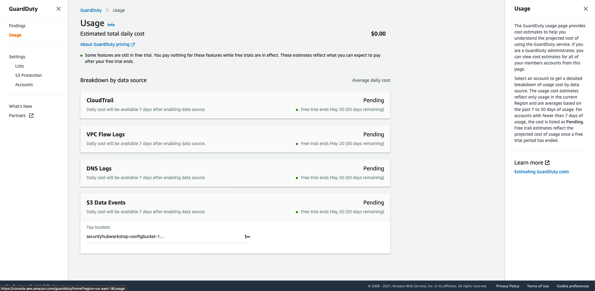

## Multi Account Hierarchy  
You can invite other AWS accounts to enable Amazon GuardDuty and become associated with your AWS account. There are two ways to associate accounts with a GuardDuty administrator account: either through an AWS Organizations organization that both accounts are members of, or by sending an invitation through GuardDuty.  

If the owner of the account that you invite enables GuardDuty and then accepts the invitation, your account is designated as the administrator GuardDuty account, and the invited accounts become associated as member accounts. When the invited account accepts the invitation, permission is granted to the master account to view the findings in the member account. 

If you need to onboard multiple AWS accounts that aren't part of your AWS Organisations organisation, you can automate the enabling or disabling of GuardDuty on multiple accounts using the scripts from the sample repository on GitHub at https://github.com/aws-samples/amazon-guardduty-multiaccount-scripts. Use the process in this section to enable GuardDuty for a list of member accounts using Amazon EC2. For information about using the disable script or setting up the script locally refer, to the GitHub instructions. 

In this section we will add a member account to your Workshop GuardDuty Account by sending an invitation. These instructions use sample information and will not actually setup the Multi-Account Hierarchy. 

!!! info "(Optional)You can invite another AWS account you are the owner of to enable Amazon GuardDuty and become associated with your Workshop AWS account.  In the steps below, instead of false data use information for another you AWS account you own, you can accept the invitation, and you can enable Amazon GuardDuty."

1. Under **Settings**, click on **Accounts** on the left hand navigation.

    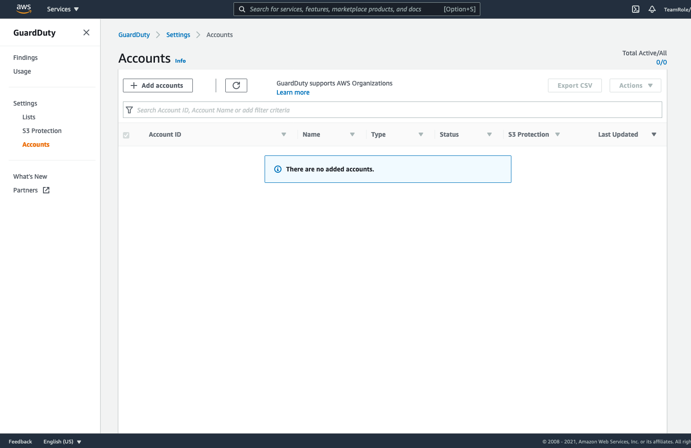

2. Click **+ Add accounts** in the above the empty account table.

3. Enter **111122223333** (Four 1's, 2's, & 3's) in the **Account ID** field.

4. Enter a valid formatted **email address**. (for this example it doesn't have to be a real email.)

5. Click **Add**

    !!! info "Be sure to hit the tab key to get the Add button to enable.  The email does not need to be the AWS account owner.  The Add workflow allows you to add multiple member account invitations at a time."

    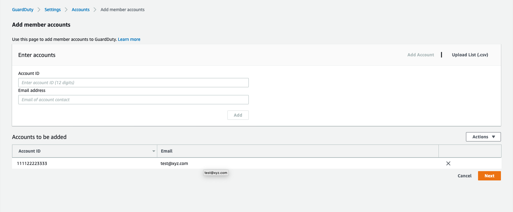

6. Click **Next**

7. Click **Invite** in the Status field of the member accounts table.

8. Click **Invite**.

    !!! info "At this point a user with the appropriate permissions in the destination AWS account could accept this invite from the master account"

    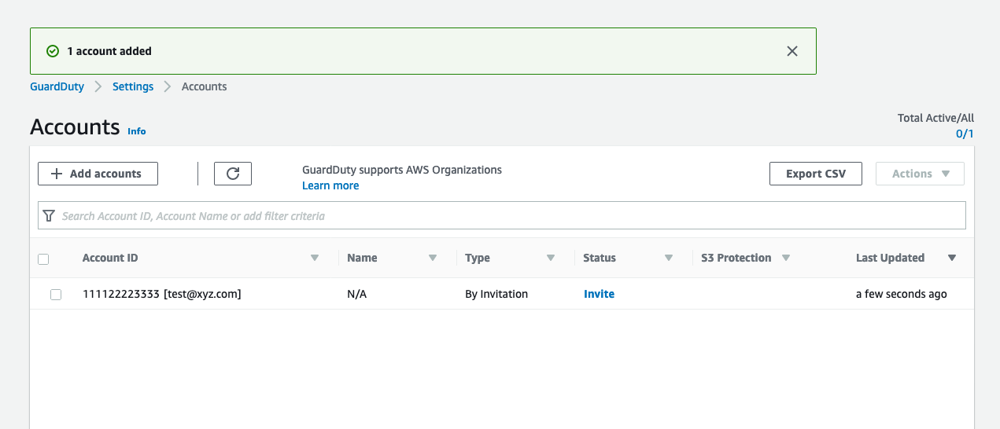


## Working with trusted IP Lists and Threat Lists
Amazon GuardDuty monitors the security of your AWS environment by analyzing and processing VPC Flow Logs, AWS CloudTrail event logs, and DNS logs. You can customize this monitoring scope by configuring GuardDuty to also use your own trusted IP lists and threat lists. The IP lists described below will apply to all VPC Flow Log and CloudTrail findings, but do not apply to DNS findings

Trusted IP lists consist of IP addresses that you have trusted for secure communication with your AWS infrastructure and applications. GuardDuty does not generate VPC Flow Log or CloudTrail findings for IP addresses on trusted IP lists. At any given time, you can have only **one uploaded trusted IP list** per AWS account per Region.

Threat lists consist of known malicious IP addresses. GuardDuty generates findings based on threat lists. At any given time, you can have up to **six uploaded threat lists** per AWS account per Region. 

!!! info "In multi-account environments only users from GuardDuty administrator accounts can upload and manage trusted IP lists and threat lists. Trusted IP lists and threat lists that are uploaded by the administrator account are imposed on GuardDuty functionality in its member accounts."

In this workshop we will focus on creating a simple trusted IP list and uploading it to GuardDuty.

1. Open a local text editor and paste the following IP ranges. 

```
54.20.175.217
205.0.0.0/8
```

2. Save the file as `ip-list.txt`.

3. Using the search bar at the top of the AWS console, navigate to S3.

    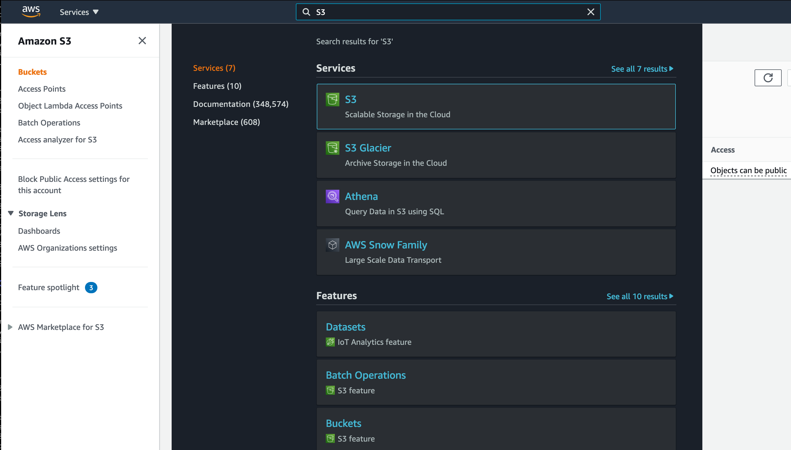

4. Create a new bucket that will store the IP list. 

    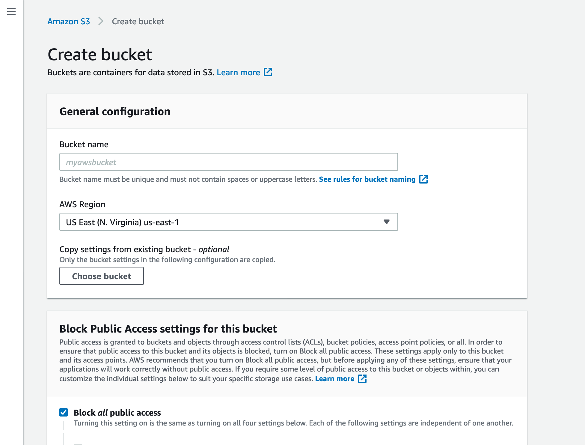

    !!! info "Keep in mind that S3 bucket names need to be unique."

4. Navigate the the newly created S3 Bucket and click **Upload**. This will open a new dialog panel where you can select and upload the file you created in the previous step.

    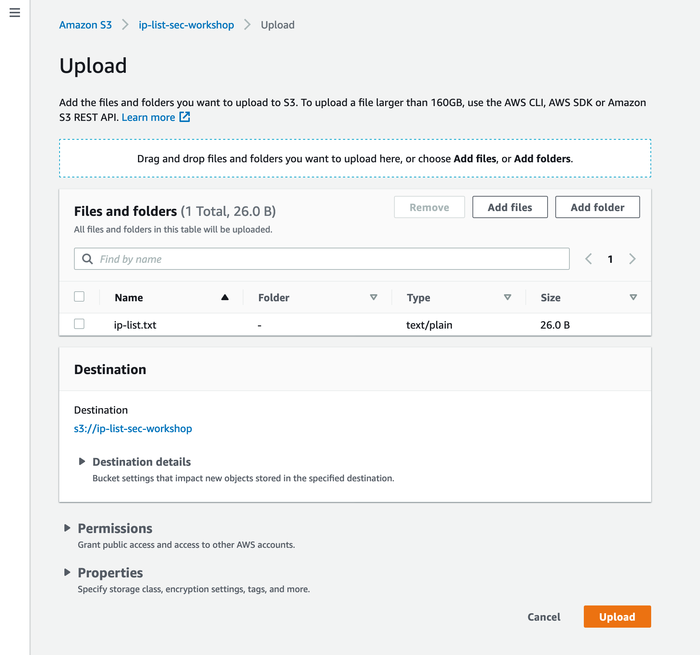

5. You should now be able to see the `ip-list.txt` file in the S3 bucket. Select the file and click the upper button that says **Copy URL**. You will need this to configure the trusted IP list in GuardDuty. 

    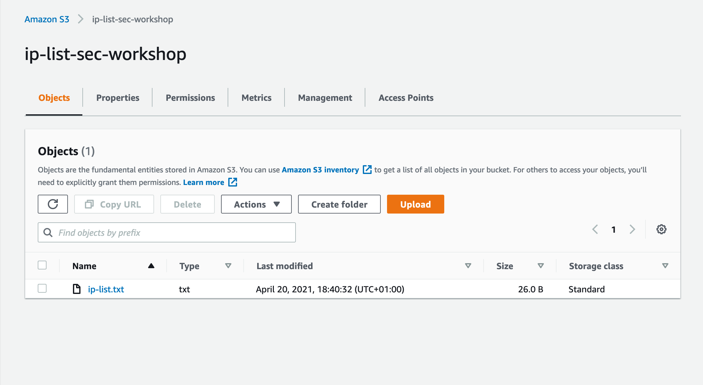

6. We now have a basic IP list that has been uploaded to S3. Using the top search bar, navigate to the **GuardDuty** service.

7. Under **Settings**, click on the **Lists** page. This should open a page similar to the one below. 

    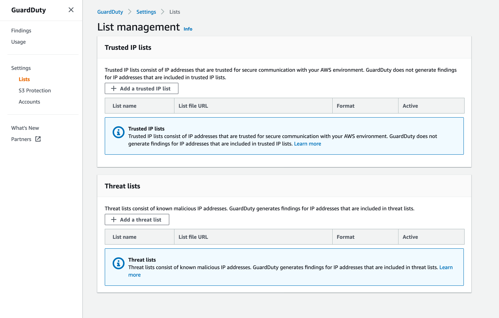

8. Click the **Add a trusted IP list** button. 

    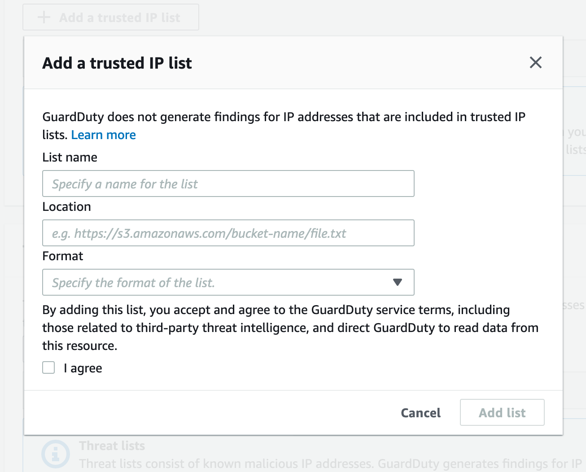

9. For **List name** provide a name for the list.

10. Paste the saved URL for the IP list you uploaded to S3 in the **Location** field.

11. Under the **Format** dropdown button, select the **Plaintext** format. 

12. After agreeing to the GuardDuty terms, you should see the list added to your Trusted IP list. 

    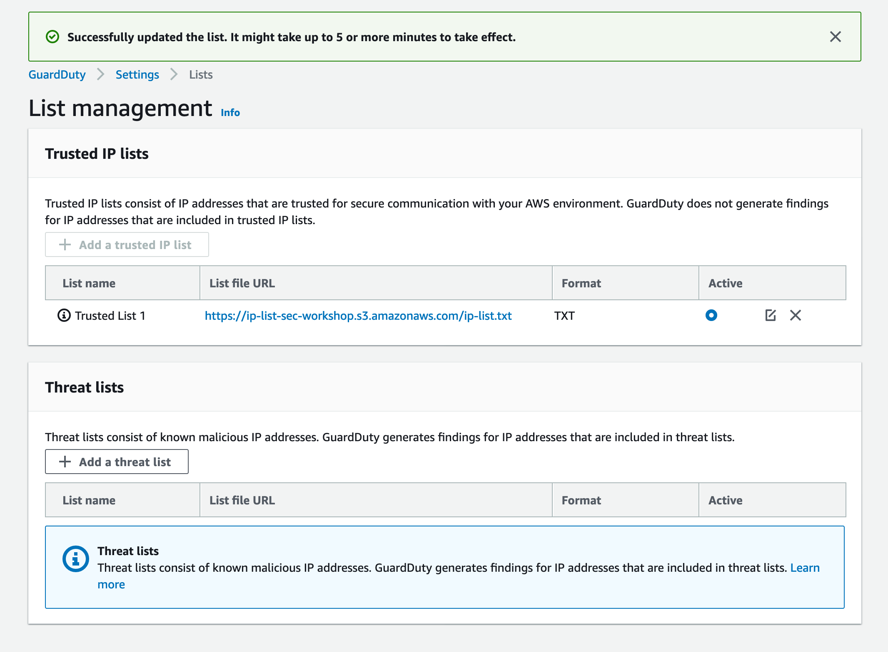

    !!! info "Do not forget to click the radio button under the Active column to activate the list. It can take up to 5 minutes for the list to become active after enabling it."


Now that you have explored GuardDuty's capabilities, you can proceed to the next module.


